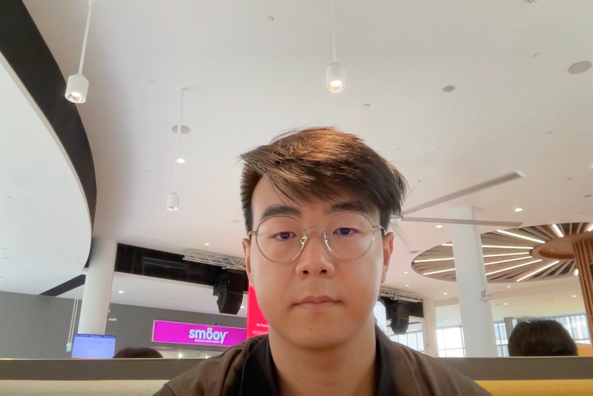
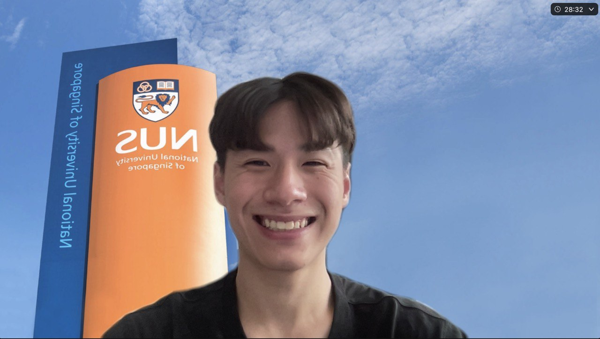

# About Us

We are a team based in the [School of Computing, National University of Singapore](http://www.comp.nus.edu.sg).

## Project team

### Keagan Pang

[[github](https://github.com/keaganpzh)]

* Role: Git expert
* Responsibilities: Integration

### Pan Xinping

[[github](http://github.com/p-xp)]

* Role: Team Lead
* Responsibilities: Deliverables & Deadlines

### Joe Chua

[[github](http://github.com/wasjoe1)]

* Role: Developer
* Responsibilities: Documentation

### Samuel Lim

[[github](http://github.com/samuelim01)]
[[portfolio](team/samuelim01.md)]

* Role: IDE/Java expert
* Responsibilities: Code Quality

### Shannon Tsou

[[github](http://github.com/tllshan)]

* Role: Developer
* Responsibilities: Testing, Scheduling & Tracking
