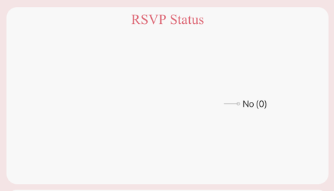
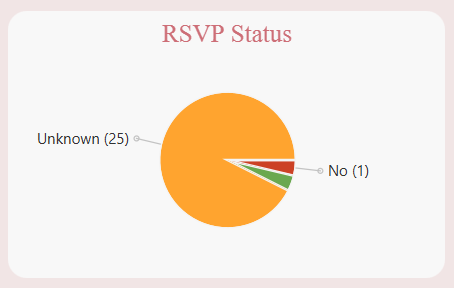
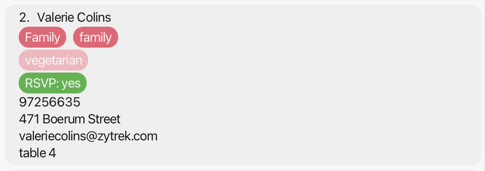
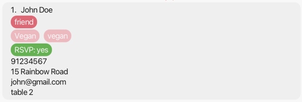
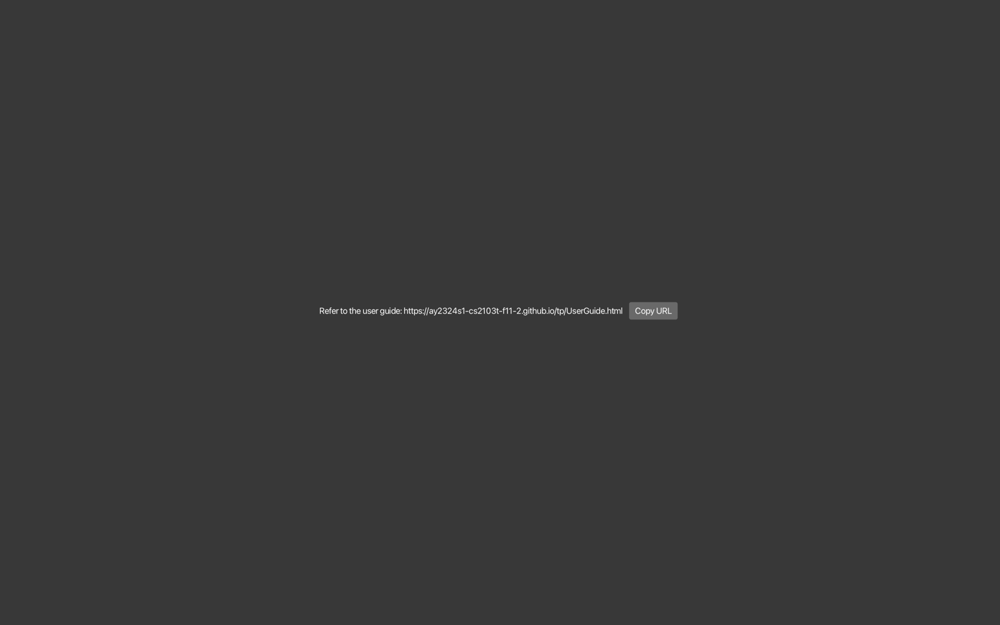
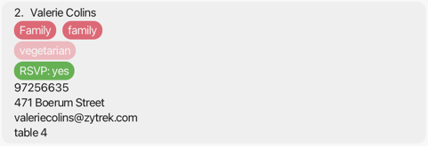

# WedLog Developer Guide

<!-- * Table of Contents -->
<page-nav-print />

1. [Acknowledgements](#1-acknowledgements) 
2. [Setting up, getting started](#2-setting-up-getting-started) 
3. [Design](#3-design) 
    3.1. [Architecture](#3--1-architecture) 
    3.2. [UI component](#3-2-ui-component) 
    3.3. [Logic component](#3-3-logic-component) 
    3.4. [Model component](#3-4-model-component) 
    3.5. [Storage component](#3-5-storage-component) 
    3.6. [Common classes](#3-6-common-classes) 
4. [Implementation](#4-implementation) 
    4.1. [Tracking of Guests and Vendors](#4-1-tracking-of-guests-and-vendors) 
    4.2. [Add Guest and Vendor feature](#4-2-add-guest-and-vendor-feature) 
    4.3. [Delete Guest and Vendor feature](#4-3-delete-guest-and-vendor-feature) 
    4.4. [Filter Guest and Vendor feature](#4-4-filter-guest-and-vendor-feature) 
    4.5. [Edit Guest and Vendor feature](#4-5-edit-guest-and-vendor-feature) 
    4.6. [Undo/redo feature](#4-6-undoredo-feature) 
    4.7. [[Proposed] Data archiving](#4-7-proposed-data-archiving) 
5. [Documentation, logging, testing, configuration, dev-ops](#5-documentation-logging-testing-configuration-dev-ops) 
6. [Appendix A: Requirements](#6-appendix-a-requirements) 
    6.1. [Product scope](#6-1-product-scope) 
    6.2. [User stories](#6-2-user-stories) 
    6.3. [Use cases](#6-3-use-cases) 
    6.4. [Non-functional requirements](#6-4-non-functional-requirements) 
    6.5. [Glossary](#6-5-glossary) 
7. [Appendix B: Instructions for manual testing](#7-appendix-b-instructions-for-manual-testing) 
    7.1. [Launch and shutdown](#7-1-launch-and-shutdown) 
    7.2. [Loading data](#7-2-loading-data) 
    7.3. [Adding guests](#7-3-adding-guests) 
    7.4. [Deleting guests](#7-4-deleting-guests) 
    7.5. [Editing guests](#7-5-editing-guests) 
    7.6. [Filtering guests](#7-6-filtering-guests) 
    7.7. [Adding vendors](#7-7-adding-vendors) 
    7.8. [Deleting vendors](#7-8-deleting-vendors) 
    7.9. [Editing vendors](#7-9-editing-vendors) 
    7.10. [Filtering vendors](#7-10-filtering-vendors) 
    7.11. [Clearing all guests and vendors](#7-11-clearing-all-guests-and-vendors) 
8. [Appendix C: Planned enhancements](#8-appendix-c-planned-enhancements) 
    8.1. [Allow special characters in names of guests and vendors](#8-1-allow-special-characters-in-names-of-guests-and-vendors) 
    8.2. [Provide more specific error messages for invalid commands](#8-2-provide-more-specific-error-messages-for-invalid-commands) 
    8.3. [Allow tracking of multiple phone numbers with differentiation](#8-3-allow-tracking-of-multiple-phone-numbers-with-differentiation) 
    8.4. [Allow text wrapping for long data fields](#8-4-allow-text-wrapping-for-long-data-fields) 
    8.5. [Improve pie chart](#8-5-improve-pie-chart-) 
    8.6. [Better duplicate detection for tags](#8-6-better-duplicate-detection-for-tags) 
    8.7. [Better duplicate detection for dietary requirements](#8-7-better-duplicate-detection-for-dietary-requirements) 
    8.8. [Allow resizing of all panels](#8-8-allow-resizing-of-all-panels) 
    8.9. [Remove full-screen support for help window (macOS)](#8-9-remove-full-screen-support-for-help-window-macos) 
    8.10. [Better colour scheme](#8-10-better-colour-scheme)
9. [Appendix D: Effort](#9-appendix-d-effort) 
    9.1. [Replacing `Person` with `Guest` and `Vendor` classes](#9-1-replacing-person-with-guest-and-vendor-classes) 
    9.2. [Altering most fields to become Optional](#9-2-altering-most-fields-to-become-optional) 
    9.3. [Enhancing `Guest` class with new parameters](#9-3-enhancing-guest-class-with-new-parameters) 
    9.4. [Enhancing the `add` and `edit` commands](#9-4-enhancing-the-add-and-edit-commands) 
    9.5. [Implementing the `filter` command](#9-5-implementing-the-filter-command) 
    9.6. [Implementing the `undo` and `redo` command](#9-6-implementing-the-undo-and-redo-command) 
    9.7. [Introducing `RsvpStatus` pie chart and `DietaryRequirements` statistics panel](#9-7-introducing-rsvpstatus-pie-chart-and-dietaryrequirements-statistics-panel)

--------------------------------------------------------------------------------------------------------------------

## **1. Acknowledgements**
- The undo / redo feature was reused with minor modifications from [Address Book(Level 4)](https://github.com/se-edu/addressbook-level4).
- The function to parse optional values was reused with minor modifications from [Jobby](https://github.com/AY2324S1-CS2103T-W08-3/tp).

--------------------------------------------------------------------------------------------------------------------

## **2. Setting up, getting started**

Refer to the guide [_Setting up and getting started_](SettingUp.md).

--------------------------------------------------------------------------------------------------------------------

## **3. Design**

### 3.1. Architecture

<puml src="diagrams/ArchitectureDiagram.puml" width="280" />

The ***Architecture Diagram*** given above explains the high-level design of the App.

Given below is a quick overview of main components and how they interact with each other.

**Main components of the architecture**

**`Main`** (consisting of classes [`Main`](https://github.com/AY2324S1-CS2103T-F11-2/tp/tree/master/src/main/java/wedlog/address/Main.java) and [`MainApp`](https://github.com/AY2324S1-CS2103T-F11-2/tp/tree/master/src/main/java/wedlog/address/MainApp.java)) is in charge of the app launch and shut down.
* At app launch, it initializes the other components in the correct sequence, and connects them up with each other.
* At shut down, it shuts down the other components and invokes cleanup methods where necessary.

The bulk of the app's work is done by the following four components:

* [**`UI`**](#ui-component): The UI of the App.
* [**`Logic`**](#logic-component): The command executor.
* [**`Model`**](#model-component): Holds the data of the App in memory.
* [**`Storage`**](#storage-component): Reads data from, and writes data to, the hard disk.

[**`Commons`**](#common-classes) represents a collection of classes used by multiple other components.

**How the architecture components interact with each other**

The *Sequence Diagram* below shows how the components interact with each other for the scenario where the user issues the command `guest delete 1`.

<puml src="diagrams/ArchitectureSequenceDiagram.puml" width="574" />

Each of the four main components (also shown in the diagram above),

* defines its *API* in an `interface` with the same name as the Component.
* implements its functionality using a concrete `{Component Name}Manager` class (which follows the corresponding API `interface` mentioned in the previous point).

For example, the `Logic` component defines its API in the `Logic.java` interface and implements its functionality using the `LogicManager.java` class which follows the `Logic` interface. Other components interact with a given component through its interface rather than the concrete class (reason: to prevent outside component's being coupled to the implementation of a component), as illustrated in the (partial) class diagram below.

<puml src="diagrams/ComponentManagers.puml" width="300" />

The sections below give more details of each component.

 

### 3.2. UI component

The **API** of this component is specified in [`Ui.java`](https://github.com/AY2324S1-CS2103T-F11-2/tp/tree/master/src/main/java/wedlog/address/ui/Ui.java)

<puml src="diagrams/UiClassDiagram.puml" alt="Structure of the UI Component"/>

The UI consists of a `MainWindow` that is made up of parts e.g.`CommandBox`, `ResultDisplay`, `GuestListPanel`, `VendorListPanel`, `StatisticsPanel`, `StatusBarFooter` etc. All these, including the `MainWindow`, inherit from the abstract `UiPart` class which captures the commonalities between classes that represent parts of the visible GUI.

The `UI` component uses the JavaFx UI framework. The layout of these UI parts are defined in matching `.fxml` files that are in the `src/main/resources/view` folder. For example, the layout of the [`MainWindow`](https://github.com/AY2324S1-CS2103T-F11-2/tp/tree/master/src/main/java/wedlog/address/ui/MainWindow.java) is specified in [`MainWindow.fxml`](https://github.com/AY2324S1-CS2103T-F11-2/tp/tree/master/src/main/resources/view/MainWindow.fxml)

The `UI` component,

* executes user commands using the `Logic` component.
* listens for changes to `Model` data so that the UI can be updated with the modified data.
* keeps a reference to the `Logic` component, because the `UI` relies on the `Logic` to execute commands.
* depends on some classes in the `Model` component, as it displays `Person` object residing in the `Model`.

 

### 3.3. Logic component

**API** : [`Logic.java`](https://github.com/AY2324S1-CS2103T-F11-2/tp/tree/master/src/main/java/wedlog/address/logic/Logic.java)

Here's a (partial) class diagram of the `Logic` component:

<puml src="diagrams/LogicClassDiagram.puml" width="550"/>

The sequence diagram below illustrates the interactions within the `Logic` component, taking `execute("guest delete 1")` API call as an example.

<puml src="diagrams/DeleteSequenceDiagram.puml" alt="Interactions Inside the Logic Component for the `guest delete 1` Command" />

<box type="info" seamless>

**Note:** The lifeline for `GuestCommandParser` and `GuestDeleteCommandParser` should end at the destroy marker (X) but due to a limitation of PlantUML, the lifeline reaches the end of diagram.
</box>

How the `Logic` component works:

1. When `Logic` is called upon to execute a command, it is passed to an `AddressBookParser` object which in turn creates a general parser that matches the command (e.g., `GuestCommandParser`).
2. In turn, the general parser creates a parser that matches the command (e.g., `GuestDeleteCommandParser`) and uses it to parse the command.
3. This results in a `Command` object (more precisely, an object of one of its subclasses e.g., `GuestDeleteCommand`) which is executed by the `LogicManager`.
4. The command can communicate with the `Model` when it is executed (e.g. to delete a guest).
5. The result of the command execution is encapsulated as a `CommandResult` object which is returned back from `Logic`.

Here are the other classes in `Logic` (omitted from the class diagram above) that are used for parsing a user command:

<puml src="diagrams/ParserClasses.puml" width="600"/>

How the parsing works:
* When called upon to parse a user command, the `AddressBookParser` class creates a `GuestCommandParser` or `VendorCommandParser` depending on the command. This class then creates an `XYZCommandParser` (`XYZ` is a placeholder for the specific command name e.g., `GuestAddCommandParser`) which uses the other classes shown above to parse the user command and create a `XYZCommand` object (e.g., `GuestAddCommand`) which the `AddressBookParser` returns back as a `Command` object.
* All `XYZCommandParser` classes (e.g., `GuestAddCommandParser`, `VendorDeleteCommandParser`, ...) inherit from the `Parser` interface so that they can be treated similarly where possible e.g, during testing.

 

### 3.4. Model component
**API** : [`Model.java`](https://github.com/AY2324S1-CS2103T-F11-2/tp/tree/master/src/main/java/wedlog/address/model/Model.java)

<puml src="diagrams/ModelClassDiagram.puml" width="450" />

The `Model` component,

* stores the address book data e.g., all `Guest` objects (which are contained in a `UniqueGuestList` object).
* stores the currently 'selected' `Guest` objects (e.g., results of a search query) as a separate _filtered_ list which is exposed to outsiders as an unmodifiable `ObservableList<Guest>` that can be 'observed' e.g. the UI can be bound to this list so that the UI automatically updates when the data in the list change.
* stores a `UserPref` object that represents the user’s preferences. This is exposed to the outside as a `ReadOnlyUserPref` objects.
* does not depend on any of the other three components (as the `Model` represents data entities of the domain, they should make sense on their own without depending on other components)

<box type="info" seamless>

**Note:** An alternative (arguably, a more OOP) model is given below. It has a `Tag` list in the `AddressBook`, which `Person` references. This allows `AddressBook` to only require one `Tag` object per unique tag, instead of each `Person` needing their own `Tag` objects. 

<puml src="diagrams/BetterModelClassDiagram.puml" width="450" />

</box>

 

### 3.5. Storage component

**API** : [`Storage.java`](https://github.com/AY2324S1-CS2103T-F11-2/tp/tree/master/src/main/java/wedlog/address/storage/Storage.java)

<puml src="diagrams/StorageClassDiagram.puml" width="550" />

The `Storage` component,
* can save both address book data and user preference data in JSON format, and read them back into corresponding objects.
* inherits from both `AddressBookStorage` and `UserPrefStorage`, which means it can be treated as either one (if only the functionality of only one is needed).
* depends on some classes in the `Model` component (because the `Storage` component's job is to save/retrieve objects that belong to the `Model`)

 

### 3.6. Common classes

Classes used by multiple components are in the `wedlog.addressbook.commons` package.

--------------------------------------------------------------------------------------------------------------------

## **4. Implementation**

This section describes some noteworthy details on how certain features are implemented.

### 4.1. Tracking of Guests and Vendors

#### Implementation

The `AddressBook` component stores the list of guests and vendors in the `UniqueGuestList` and `UniqueVendorList` classes respectively. These classes extend `UniquePersonList`, which is a generic class that stores a list of `Person` objects. `Person` is a class that represents a person in the address book. It has two subclasses, `Guest` and `Vendor`, which represent a guest and a vendor respectively. `Guest` has additional fields of `RsvpStatus`, `DietaryRequirement` and `TableNumber` objects. 

Furthermore, all fields except `Name` in `Person` and its subclasses are wrapped in an `Optional`. This allows for attributes to be optional, allowing for greater flexibility.  

A `RsvpStatus` object has one of three possible values stored as a String: "yes", "no", and "unknown". The default value of a `RsvpStatus` is "unknown".

Like `Tag`, a `Guest` can store multiple `DietaryRequirement` objects. As such, it is optional by nature.

A `TableNumber` object stores a table number as an integer. It is wrapped in an `Optional` as well.

<puml src="diagrams/GuestClassDiagram.puml" alt="GuestClassDiagram" />

#### Design considerations

**Aspect: How to store guests and vendors**
* **Alternative 1:** Store both guests and vendors in the same list
  * Pros: Easier to implement, less code duplication.
  * Cons: Will make it difficult to implement features that are specific to either guests or vendors.
* **Alternative 2 (current choice):** Store guests and vendors in separate lists.
  * Pros: Allows for greater flexibility in implementing features that are specific to either guests or vendors.
  * Cons: More code duplication.

 

### 4.2. Add Guest and Vendor feature

#### Implementation

The add feature allows users to add new guests or vendors with the compulsory field `Name`, along with any of the optional
fields mentioned in the [Tracking of Guests and Vendors](#4-1-tracking-of-guests-and-vendors) section. The feature is implemented through the
classes `GuestAddCommand` and `VendorAddCommand`. The implementation of the various classes facilitating the add feature
on `Guest` and `Vendor` objects differ only in specifics that are not relevant here, so the keywords `Guest` and `Vendor` will be 
replaced by `XYZ` (e.g. `XYZAddCommand` can be substituted with both `GuestAddCommand` and `VendorAddCommand`).

Given below is an example usage scenario and how the add mechanism behaves at each step. You may also refer to the sequence
diagrams provided for a visual representation of the process.

Step 1. The user launches the application. WedLog shows all guests and vendors in their respective lists.

Step 2. The user executes `xyz add n/Annette t/friend`, where `xyz` is either `guest` or `vendor`. This allows the user to add
a guest or vendor with the name `Annette` and tag `friend`. 

Step 3. `AddressBookParser` parses the `xyz` keyword and creates the `XYZCommandParser`. 
`XYZCommandParser` parses the `add` keyword and creates a `XYZAddCommandParser` object. It also calls `XYZAddCommandParser#parse` to parse the inputted fields.

<puml src="diagrams/AddParseSequenceDiagram.puml" alt="AddParseSequenceDiagram" />

Step 4. `#parse` calls upon `ParserUtil#parseABC`, where `ABC` is the field being added, to check the validity of the
user input and convert it into field objects (e.g. string representing a new name into a `Name` object).
`#parse` then creates an `XYZAddCommand` using the created field objects.

<puml src="diagrams/AddParseSequenceDiagramRef.puml" alt="AddParseSequenceDiagramRef" />

Step 5. Lastly, `XYZAddCommand#execute` adds a `XYZ` with the given values to the `UniqueXYZList`.
<puml src="diagrams/AddExecuteSequenceDiagram.puml" alt="AddExecuteSequenceDiagram" />

 

### 4.3. Delete Guest and Vendor feature

#### Implementation

The `delete` feature allows users to delete a guest or vendor in WedLog, through the respective classes `GuestDeleteCommand` and `VendorDeleteCommand`. Note that the implementation of `GuestDeleteCommand` and `VendorDeleteCommand` is identical and will be referred to as `XYZDeleteCommand`. The feature makes use of the current `Index` of the person in the displayed list to identify the person.

Given below is an example usage scenario and how the `delete` mechanism behaves at each step.

Step 1. The user launches the application for the first time. All guests and vendors added during the last use of the app are shown in their respective lists.

Step 2. The user executed `xyz filter r/no`, where `xyz` is either `guest` or `vendor`, to show either guests or vendors with the `RSVP Status` set to `no`.

Step 3. The user executes `xyz delete 1`, to delete the first guest or vendor **in the currently displayed list**.

Step 4. `XYZDeleteCommandParser` parses the `Index` to create a `XYZDeleteCommand`. The following sequence diagram shows how the parsing of a delete command works:

<puml src="diagrams/DeleteParseSequenceDiagram.puml" alt="DeleteParseSequenceDiagram" />

Step 5. The resulting `XYZDeleteCommand` is then executed by the `Logic Manager`. The following sequence diagram shows how the execution of a delete command works:

<puml src="diagrams/DeleteExecuteSequenceDiagram.puml" alt="DeleteExecuteSequenceDiagram" />

#### Design considerations
**Aspect: How to specify a guest or vendor using `Index`**
* **Alternative 1:** `Index` refers to the index on the full list
  * Pros: Each person is tied to a fixed index regardless of filtering
  * Cons: Requires user to remember index of persons on the full list
* **Alternative 2 (current choice):** `Index` refers to the index on the currently displayed list
  * Pros: User refers to displayed list for index of persons
  * Cons: Index of a person changes with each filter or list command

 

### 4.4. Filter Guest and Vendor feature

The implementation of the `filter` command allows the user to view a filtered list for both guests and vendors.
The filtering is based on an AND search, for example, `guest filter n/John r/yes` will show only guests that have "John" in their 
name and have also agreed to come to the wedding.
The values in the parameter have to exactly match the keywords. for example `guest filter n/John` will return a guest by the
name of `John Doe`, however a guest with the name `Johnathan` will not be returned.

#### Proposed Implementation
The filtering logic is done with predicate classes that implement Java's Predicate interface.
<puml src="diagrams/FilterPersonPredicateClassDiagram.puml" alt="FilterPersonPredicateClassDiagram" />
<puml src="diagrams/FilterGuestPredicateClassDiagram.puml" alt="FilterGuestPredicateClassDiagram" />

The following sequence diagrams shows how the `filter` command works.
<puml src="diagrams/FilterGuestSequenceDiagram.puml" alt="FilterGuestSequenceDiagram" />
<puml src="diagrams/FilterGuestSequenceDiagramRef.puml" alt="FilterGuestSequenceDiagramRef" />
<puml src="diagrams/FilterVendorSequenceDiagram.puml" alt="FilterVendorSequenceDiagram" />
<puml src="diagrams/FilterVendorSequenceDiagramRef.puml" alt="FilterVendorSequenceDiagramRef" />

When a user enters `guest filter n/John a/jurong west st 65`, the GuestFilterCommandParser created will parse the parameters in the command.
For each valid parameter, it creates the respective XYZPredicate. In the example command, there are two search criteria
corresponding to name and address, hence a `GuestNamePredicate` and a `GuestAddressPredicate` is created.

These predicates are stored in a `List` and passed to the `GuestFilterCommand` constructor. the predicates are then stored
in the `GuestFilterCommand` object and awaits execution.

Upon execution of the GuestFilterCommand, it calls and updates the model by having the predicates pass into the `preparePredicate`
internal method. In this method, the list is then converted into 1 predicate which checks if the list of predicates are 
all true. If they are, the overall predicate returns true, else false. This is done through the usage of `Stream`.
The resulting predicate is a `Predicate<Guest>`.

The model's guest list, of type `FilterList`, is then updated by passing in the resultant predicate into `setPredicate` method.
Finally, the model's guest list now only contains a filtered list of guests.

**Note: The implementation of the filter feature is the same for both vendors and guests. they only differentiate in the list that is updated (for vendors, `filterVendors` will be updated)**
**as well as the Predicates generated (for vendors, `Predicate<Vendor>` are returned).**

Given below is an example usage scenario for filtering guests and how the filter mechanism behaves at each step.

Step 1. The user launches the application for the first time. The `VersionedAddressBook` will be initialized with the initial address book state, and the `currentStatePointer` pointing to that single address book state.

Step 2. The user executes `guest add n/John doe …​` to add a new person.

Step 3. The user executes `guest add n/Johnathan …​` to add another new person.

Step 4. The user executes `guest filter n/John` to filter out names that contain the keyword "John". The execution of this `GuestFilterCommand` updates the guest list via the `updateFilteredGuestList` method.

Step 5. A list view of only the guest with name John is returned.

**Note: The guest with name "Johnathan" is not returned due to the words in the name not matching the keyword "John"**
**However, a guest with name "John doe" would be returned as his name contains the "John" word.**

 

### 4.5. Edit Guest and Vendor feature

#### Implementation

The edit feature allows users to edit the parameters of existing guests or vendors in WedLog, through the respective classes `GuestEditCommand` and `VendorEditCommand`. Note that the implementation of `GuestEditCommand` and `VendorEditCommand` is identical and will be referred to as `XYZEditCommand`. The feature uses the current `Index` of the person in the displayed list to identify the person.

Given below is an example usage scenario of `GuestEditCommand` and how the operation behaves at each step.

Step 1. The user launches the application for the first time. All guests and vendors are shown in their respective lists.

Step 2. The user executes `guest filter n/John` to show only guests with the name `John`.

Step 3. The user executes `guest edit 2 p/` to edit the 2nd guest in **the current list** to have **no phone number**.

Step 4. `GuestEditCommandParser` parses the `Index` and the additional arguments to create an `GuestEditCommand`. The following sequence diagram shows how the parsing of an edit command works:

<puml src="diagrams/EditParseSequenceDiagram.puml" alt="EditParseSequenceDiagram" />

<box type="info" seamless>

**Note:** The lifeline for `GuestCommandParser`, `GuestEditCommandParser` should end at the destroy marker (X) but due to a limitation of PlantUML, the lifeline reaches the end of diagram.

</box>

Step 5. The resulting `GuestEditCommand` object is then executed by the `LogicManager`. The following sequence diagram shows how the execution of an edit command works:

<puml src="diagrams/EditExecuteSequenceDiagram.puml" alt="EditExecuteSequenceDiagram" />

<box type="info" seamless>

**Note:** The lifeline for `GuestEditCommand` should end at the destroy marker (X) but due to a limitation of PlantUML, the lifeline reaches the end of diagram.

</box>

#### Design considerations

**Aspect: How `EditXYZDescriptor` works:**

The `EditXYZDescriptor` describes if the `XYZ` fields should be modified, deleted, or left alone.

* **Alternative 1 (current choice):**
    * For each field in `XYZ`, create two fields `field` and `isFieldEdited` in `EditXYZDesriptor`, e.g. `phone` and `isPhoneEdited`.
    * If the field should be deleted, `isFieldEdited` is `true` and `field` is `null`.
    * Pros: Easy to implement.
    * Cons: Code is stateful, less intuitive, and harder to test.

* **Alternative 2:**
    * Create a class to represent each edited field, e.g. `EditPhone`, which would capture the different states.
    * Pros: Code is more intuitive and no need to keep track of states
    * Cons: Many classes must be created

 

### 4.6. Undo/redo feature

#### Proposed Implementation

The proposed undo/redo mechanism is facilitated by `VersionedAddressBook`. It extends `AddressBook` with an undo/redo history, stored internally as an `addressBookStateList` and `currentStatePointer`. Additionally, it implements the following operations:

* `VersionedAddressBook#commit()` — Saves the current address book state in its history.
* `VersionedAddressBook#undo()` — Restores the previous address book state from its history.
* `VersionedAddressBook#redo()` — Restores a previously undone address book state from its history.

These operations are exposed in the `Model` interface as `Model#commitAddressBook()`, `Model#undoAddressBook()` and `Model#redoAddressBook()` respectively.

Given below is an example usage scenario and how the undo/redo mechanism behaves at each step.

Step 1. The user launches the application for the first time. The `VersionedAddressBook` will be initialized with the initial address book state, and the `currentStatePointer` pointing to that single address book state.

<puml src="diagrams/UndoRedoState0.puml" alt="UndoRedoState0" />

Step 2. The user executes `delete 5` command to delete the 5th person in the address book. The `delete` command calls `Model#commitAddressBook()`, causing the modified state of the address book after the `delete 5` command executes to be saved in the `addressBookStateList`, and the `currentStatePointer` is shifted to the newly inserted address book state.

<puml src="diagrams/UndoRedoState1.puml" alt="UndoRedoState1" />

Step 3. The user executes `add n/David …​` to add a new person. The `add` command also calls `Model#commitAddressBook()`, causing another modified address book state to be saved into the `addressBookStateList`.

<puml src="diagrams/UndoRedoState2.puml" alt="UndoRedoState2" />

<box type="info" seamless>

**Note:** If a command fails its execution, it will not call `Model#commitAddressBook()`, so the address book state will not be saved into the `addressBookStateList`.

</box>

Step 4. The user now decides that adding the person was a mistake, and decides to undo that action by executing the `undo` command. The `undo` command will call `Model#undoAddressBook()`, which will shift the `currentStatePointer` once to the left, pointing it to the previous address book state, and restores the address book to that state.

<puml src="diagrams/UndoRedoState3.puml" alt="UndoRedoState3" />

<box type="info" seamless>

**Note:** If the `currentStatePointer` is at index 0, pointing to the initial AddressBook state, then there are no previous AddressBook states to restore. The `undo` command uses `Model#canUndoAddressBook()` to check if this is the case. If so, it will return an error to the user rather
than attempting to perform the undo.

</box>

The following sequence diagram shows how the undo operation works:

<puml src="diagrams/UndoSequenceDiagram.puml" alt="UndoSequenceDiagram" />

<box type="info" seamless>

**Note:** The lifeline for `UndoCommand` should end at the destroy marker (X) but due to a limitation of PlantUML, the lifeline reaches the end of diagram.

</box>

The `redo` command does the opposite — it calls `Model#redoAddressBook()`, which shifts the `currentStatePointer` once to the right, pointing to the previously undone state, and restores the address book to that state.

<box type="info" seamless>

**Note:** If the `currentStatePointer` is at index `addressBookStateList.size() - 1`, pointing to the latest address book state, then there are no undone AddressBook states to restore. The `redo` command uses `Model#canRedoAddressBook()` to check if this is the case. If so, it will return an error to the user rather than attempting to perform the redo.

</box>

Step 5. The user then decides to execute the command `list`. Commands that do not modify the address book, such as `list`, will usually not call `Model#commitAddressBook()`, `Model#undoAddressBook()` or `Model#redoAddressBook()`. Thus, the `addressBookStateList` remains unchanged.

<puml src="diagrams/UndoRedoState4.puml" alt="UndoRedoState4" />

Step 6. The user executes `clear`, which calls `Model#commitAddressBook()`. Since the `currentStatePointer` is not pointing at the end of the `addressBookStateList`, all address book states after the `currentStatePointer` will be purged. Reason: It no longer makes sense to redo the `add n/David …​` command. This is the behavior that most modern desktop applications follow.

<puml src="diagrams/UndoRedoState5.puml" alt="UndoRedoState5" />

The following activity diagram summarizes what happens when a user executes a new command:

<puml src="diagrams/CommitActivityDiagram.puml" width="250" />

#### Design considerations

**Aspect: How undo & redo executes:**

* **Alternative 1 (current choice):** Saves the entire address book.
  * Pros: Easy to implement.
  * Cons: May have performance issues in terms of memory usage.

* **Alternative 2:** Individual command knows how to undo/redo by
  itself.
  * Pros: Will use less memory (e.g. for `delete`, just save the person being deleted).
  * Cons: We must ensure that the implementation of each individual command are correct.

 

### 4.7. \[Proposed\] Data archiving

_{Explain here how the data archiving feature will be implemented}_

--------------------------------------------------------------------------------------------------------------------

## **5. Documentation, logging, testing, configuration, dev-ops**

* [Documentation guide](Documentation.md)
* [Testing guide](Testing.md)
* [Logging guide](Logging.md)
* [Configuration guide](Configuration.md)
* [DevOps guide](DevOps.md)

--------------------------------------------------------------------------------------------------------------------

## **6. Appendix A: Requirements**

### 6.1. Product scope

**Target user profile**:
A bride or groom who
* Is tech-savvy and is comfortable using CLI
* Can type fast
* Prefers working on a desktop
* Wants to plan their own wedding
* Has a partner who is uninvolved in the planning process
* Values efficiency and having a consolidated wedding planning platform

**Value proposition**: consolidate all information related to wedding guests and vendors into 1 platform for 
streamlined planning.

 

### 6.2. User stories

Priorities: High (must have) - `* * *`, Medium (nice to have) - `* *`, Low (unlikely to have) - `*`

| Priority | As a …​                         | I want to …​                                          | So that I can…​                                                |
|----------|---------------------------------|-------------------------------------------------------|----------------------------------------------------------------|
| `* * *`  | new user                        | add new guests with name and contact                  | keep track of the people whom I invited to the wedding         |
| `* * *`  | new user                        | remove existing guests                                | remove guests I erroneously added                              |
| `* * *`  | new user                        | record down dietary requirements for guests           | cater correct types of meals for my guests                     |
| `* * *`  | new user                        | update RSVP status of a guest                         | track who is coming                                            |
| `* * *`  | new user                        | save data into local storage                          | keep my data even after I exit the app                         |
| `* * *`  | new user                        | retrieve data from local storage                      | access past data that I have inputted                          |
| `* * *`  | user liaising with many vendors | add new vendor with name and contact                  | keep track of which vendors I am currently in contact with     |
| `* * *`  | user liaising with many vendors | remove existing vendors                               | remove vendors I erroneously added                             |
| `* *`    | user with many guests           | view how many guests have RSVP'd                      | know how many guests are confirmed to be coming                |
| `* *`    | user with many guests           | view a specific guest's details                       | understand the arrangements I've made for a particular guest   |
| `* *`    | user with many guests           | view the total number of each type of diet            | cater the appropriate number and types of meals                |
| `* *`    | user with many guests           | filter guests with dietary restrictions               | cater alternate meals for them                                 |
| `* *`    | user with many guests           | assign a guest to a table number                      | keep track of seating arrangements                             |
| `* *`    | user with many guests           | filter guests by table                                | see who is sitting at each table                               |
| `* *`    | user with many guests           | add guests to a group                                 | know which group a guest belongs to                            |
| `* *`    | user with many guests           | filter guests by groups (eg family, friends)          | access and manage relevant information for each group          |
| `*`      | financially savvy user          | track my total expenses                               | stay within budget                                             |
| `*`      | financially savvy user          | keep track of the costs associated with each vendor   | track how much I have spent on the wedding                     |
| `*`      | financially savvy user          | record gift registry                                  | take note of which gifts are already bought, and by who        |
| `*`      | financially savvy user          | keep track of red packets received from guests        | keep future references on gift exchange                        |
| `*`      | financially savvy user          | view total amount I collected from wedding presents   | know how much cash I have                                      |
| `*`      | user finding a wedding location | record pros and cons of possible locations            | choose the best location                                       |
| `*`      | task-oriented user              | add tasks and track roadmap                           | keep track of the wedding planning progress                    |
| `*`      | task-oriented user              | get reminders to do tasks when deadlines are nearing  | not miss important deadlines                                   |
| `*`      | task-oriented user              | assign tasks and deadlines to guests                  | keep track of when I need to follow-up with them               |
| `*`      | task-oriented user              | assign tasks and deadlines to vendors                 | keep track of when I need to follow-up with them               |
| `*`      | task-oriented user              | view all the deadlines that have passed               | identify the actions that I need to prioritise                 |
| `*`      | task-oriented user              | view countdown to wedding                             | know the time I have left till the wedding                     |
| `*`      | user planning my reception      | plan the flow of events during the reception          | know when to do what                                           |
| `*`      | experienced user                | view most recent commands                             | look back on what was recorded previously                      |
| `*`      | experienced user                | undo the last command                                 | undo accidental or erroneous commands                          |
| `*`      | experienced user                | import data from a csv file format onto this platform | easily transfer existing information from other sources        |
| `*`      | experienced user                | export data into an excel format                      | easily send data to vendors                                    |
| `*`      | experienced user                | share my address book with another user               | plan the wedding together with my partner                      |
| `*`      | experienced user                | add custom fields for guests                          | keep track of miscellaneous information specific to my wedding |

 

### 6.3. Use cases
(For all use cases below, the **System** is the `WedLog` and the **Actor** is the `user`, unless specified otherwise)

<ins>**Use case: UC1 - Add a guest**</ins>

**MSS:**
1. User provides guest details.
2. WedLog adds the guest to the guest list.
 Use case ends.

**Extensions:**
 1a. The given input format is invalid.
 &nbsp;&nbsp;&nbsp;&nbsp;1a1. WedLog shows an error message.
 &nbsp;&nbsp;&nbsp;&nbsp;1a2. User provides guest details in a different format.
 &nbsp;&nbsp;&nbsp;&nbsp;Steps 1a1-1a2 are repeated until the User input format is valid.
 &nbsp;&nbsp;&nbsp;&nbsp;Use case resumes from step 2.
 1b. The guest list has reached maximum capacity.
 &nbsp;&nbsp;&nbsp;&nbsp;1b1. WedLog shows an error message.
 &nbsp;&nbsp;&nbsp;&nbsp;Use case ends.
 1c. The guest already exists in the guest list.
 &nbsp;&nbsp;&nbsp;&nbsp;1c1. WedLog shows an error message.
 &nbsp;&nbsp;&nbsp;&nbsp;Use case ends.
 *a. At any time, user inputs an invalid command/syntax.
 &nbsp;&nbsp;&nbsp;&nbsp;*a1. WedLog shows an error message.

 

<ins>**Use case: UC2 - Delete a guest**</ins>

**MSS:**
1. User requests to <ins>list all guests</ins> (UC3).
2. WedLog shows a list of guests.
3. User requests to delete a specific guest in the list via its index.
4. WedLog deletes the guest.
 Use case ends.

**Extensions:**
 3a. The given index is invalid.
 &nbsp;&nbsp;&nbsp;&nbsp;3a1. WedLog shows an error message.
 &nbsp;&nbsp;&nbsp;&nbsp;3a2. User requests to delete the guest using a different index.
 &nbsp;&nbsp;&nbsp;&nbsp;Steps 3a1-3a2 are repeated until the User provides a valid index.
 &nbsp;&nbsp;&nbsp;&nbsp;Use case resumes from step 4.
 *a. At any time, user inputs an invalid command/syntax.
 &nbsp;&nbsp;&nbsp;&nbsp;*a1. WedLog shows an error message.

 

<ins>**Use case: UC3 - View all guests**</ins>

**MSS:**
1. User requests to list all guests.
2. WedLog displays a list of guests.
 Use case ends.

**Extensions:**
 *a. At any time, user inputs an invalid command/syntax.
 &nbsp;&nbsp;&nbsp;&nbsp;*a1. WedLog shows an error message.

 

<ins>**Use case: UC4 - View a specific guest**</ins>

**MSS:**
1. User requests to <ins>list all guests</ins> (UC3).
2. WedLog displays a list of guests.
3. User requests to view a specific guest in the list.
4. WedLog displays the guest’s details.
 Use case ends.

**Extensions:**
 3a. The given index is invalid.
 &nbsp;&nbsp;&nbsp;&nbsp;3a1. WedLog shows an error message.
 &nbsp;&nbsp;&nbsp;&nbsp;Use case resumes at step 2.
 *a. At any time, user inputs an invalid command/syntax.
 &nbsp;&nbsp;&nbsp;&nbsp;*a1. WedLog shows an error message.

 

<ins>**Use case: UC5 - Add a vendor**</ins>

**MSS:**
1. User provides vendor details.
2. WedLog adds the vendor to the vendor list.
 Use case ends.

**Extensions:**
 1a. The given input format is invalid.
 &nbsp;&nbsp;&nbsp;&nbsp;1a1. WedLog shows an error message.
 &nbsp;&nbsp;&nbsp;&nbsp;1a2. User provides vendor details in a different format.
 &nbsp;&nbsp;&nbsp;&nbsp;Steps 1a1-1a2 are repeated until the User input format is valid.
 &nbsp;&nbsp;&nbsp;&nbsp;Use case resumes from step 2.
 1b. The vendor list has reached maximum capacity.
 &nbsp;&nbsp;&nbsp;&nbsp;1b1. WedLog shows an error message.
 &nbsp;&nbsp;&nbsp;&nbsp;Use case ends.
 1c. The guest already exists in the vendor list.
 &nbsp;&nbsp;&nbsp;&nbsp;1c1. WedLog shows an error message.
 &nbsp;&nbsp;&nbsp;&nbsp;Use case ends.
 *a. At any time, user inputs an invalid command/syntax.
 &nbsp;&nbsp;&nbsp;&nbsp;*a1. WedLog shows an error message.

 

<ins>**Use case: UC6 - Delete a vendor**</ins>

**MSS:**
1. User requests to <ins>list all vendors</ins> (UC7).
2. WedLog shows a list of vendors.
3. User requests to delete a specific vendor in the list via its index.
4. WedLog deletes the vendor.
 Use case ends.

**Extensions:**
 3a. The given index is invalid.
 &nbsp;&nbsp;&nbsp;&nbsp;3a1. WedLog shows an error message.
 &nbsp;&nbsp;&nbsp;&nbsp;3a2. User requests to delete the vendor using a different index.
 &nbsp;&nbsp;&nbsp;&nbsp;Steps 3a1-3a2 are repeated until the User provides a valid index.
 &nbsp;&nbsp;&nbsp;&nbsp;Use case resumes from step 4.
 *a. At any time, user inputs an invalid command/syntax.
 &nbsp;&nbsp;&nbsp;&nbsp;*a1. WedLog shows an error message.

 

<ins>**Use case: UC7 - View all vendors**</ins>

**MSS:**
1. User requests to list all vendors.
2. WedLog displays a list of vendors.
 Use case ends.

**Extensions:**
 *a. At any time, user inputs an invalid command/syntax
 &nbsp;&nbsp;&nbsp;&nbsp;*a1. WedLog shows an error message.

 

<ins>**Use case: UC8 - View a specific vendor**</ins>

**MSS:**
1. User requests to <ins>list all vendors</ins> (UC7).
2. WedLog displays a list of vendors.
3. User requests to view a specific vendor in the list.
4. WedLog displays the vendor’s details.
 Use case ends.

**Extensions:**
 3a. The given index is invalid.
 &nbsp;&nbsp;&nbsp;&nbsp;3a1. WedLog shows an error message.
 &nbsp;&nbsp;&nbsp;&nbsp;Use case resumes at step 2.
 *a. At any time, user inputs an invalid command/syntax.
 &nbsp;&nbsp;&nbsp;&nbsp;*a1. WedLog shows an error message.

 

### 6.4. Non-functional requirements

1. Should work on any _mainstream OS_ as long as it has Java `11` or above installed.
2. Should be able to hold up to 1000 persons without a noticeable sluggishness in performance for typical usage.
3. A user with above average typing speed for regular English text (i.e. not code, not system admin commands) should be able to accomplish most of the tasks faster using commands than using the mouse. 
4. Should work without internet connection 
5. For any command, the system should respond within 2 seconds. 
6. Should be usable for colour-blind users. 
7. Should provide comprehensive documentation for users to learn how to use the command-line interface effectively. 
8. Should provide clear and user-friendly error messages, guiding users on how to rectify issues. 
9. Should log errors for analysis and debugging.

 

### 6.5. Glossary

* **Mainstream OS**: Windows, Linux, Unix, MacOS
* **CLI**: Command Line Interface
* **GUI**: Graphical User Interface
* **JSON**: [JavaScript Object Notation](https://www.json.org/json-en.html)
* **Private contact detail**: A contact detail that is not meant to be shared with others

--------------------------------------------------------------------------------------------------------------------

## **7. Appendix B: Instructions for manual testing**

Given below are instructions to test the app manually.

<box type="info" seamless>

**Note:** These instructions only provide a starting point for testers to work on;
testers are expected to do more *exploratory* testing.

</box>

### 7.1. Launch and shutdown

1. Initial launch

   1. Download the `.jar` file and copy into an empty folder

   2. Double-click the `.jar` file Expected: Shows the GUI with a set of sample contacts. The window size may not be optimum.

2. Saving window preferences

   1. Resize the window to an optimum size. Move the window to a different location. Close the window.

   2. Re-launch the app by double-clicking the `.jar` file. 
       Expected: The most recent window size and location is retained.

 

### 7.2. Loading data

Prerequisites: Before launching the application, open the `data` folder.

1. Delete the `data/addressbook.json` file  
   Expected: Upon app launch, the app is populated with sample data.

2. Delete the `data` folder  
   Expected: Upon app launch, the app is populated with sample data.

3. Corrupt the `data/addressbook.json` file  
   Expected: Upon app launch, the app has no guests or vendors populated.

 

### 7.3. Adding guests

1. Adding a guest: `guest add n/John Doe`  
   Expected: Guest with the name `John Doe` is added.

2. Adding a guest without a name: `guest add e/johndoe@example.com`  
   Expected: No guest is added, and an error message is shown.

3. Adding a guest with an invalid RSVP status: `guest add n/John Doe r/invalid`  
   Expected: No guest is added, and an error message is shown.

 

### 7.4. Deleting guests

Prerequisites: List all guests using the `guest list` command. There should be at least 3, but less than 10,000 guests in the list.

1. Deleting a guest: `guest delete 3`  
   Expected: The third guest is removed from the list.

2. Deleting a guest that does not exist: `guest delete 10000`  
   Expected: No guest is deleted, and an error message is shown.

3. Deleting a guest with an invalid index: `guest delete 0`  
   Expected: No guest is deleted, and an error message is shown.

 

### 7.5. Editing guests

Prerequisites: List all guests using the `guest list` command. There should be at least 3, but less than 10,000 guests in the list.

1. Editing a guest: `guest edit 2 p/68423611`  
   Expected: The second guest in the list has their phone number updated to `68423611`.

2. Editing multiple fields of a guest: `guest edit 3 tn/2 r/yes`  
   Expected: The third guest in the list has their table number updated to `2` and their RSVP status to `yes`.

3. Editing a guest with invalid name: `guest edit 3 n/!nvalid N@me`  
   Expected: No guest is edited, and an error message is shown.

4. Editing a guest without specifying any edits: `guest edit 2`  
   Expected: No guest is edited, and an error message is shown.

5. Editing a guest that does not exist: `guest edit 10000`  
   Expected: No guest is edited, and an error message is shown.

 

### 7.6. Filtering guests

Prerequisites: There should be multiple guests in the list.

1. Filter guests by tag: `guest filter t/friends`  
   Expected: Only guests with the tag `friends` should be shown.

2. Filter guests by multiple tags: `guest filter t/friends t/colleagues`  
   Expected: Only guests with **both** tags `friends` and `colleagues` should be shown.

3. Filter guests without specifying fields: `guest filter`  
   Expected: The vendor list remains unchanged, and an error message is shown.

 

### 7.7. Adding vendors

1. Adding a vendor: `vendor add n/John Doe`  
    Expected: Vendor with the name `John Doe` is added.

2. Adding a vendor without a name: `vendor add e/johndoe@example.com`  
    Expected: No vendor is added, and an error message is shown.

3. Adding a vendor with an invalid email: `vendor add n/John e/invalidemail`  
    Expected: No vendor is added, and an error message is shown.

 

### 7.8. Deleting vendors

Prerequisites: List all vendors using the `vendor list` command. There should be at least 3, but less than 10,000 vendors in the list.

1. Deleting a vendor: `vendor delete 3`  
    Expected: The third vendor is removed from the list.
 
2. Deleting a vendor that does not exist: `vendor delete 10000`  
    Expected: No vendor is deleted, and an error message is shown.

3. Deleting a vendor with an invalid index: `vendor delete 0`  
    Expected: No vendor is deleted, and an error message is shown.

 

### 7.9. Editing vendors

Prerequisites: List all vendors using the `vendor list` command. There should be at least 3, but less than 10,000 vendors in the list.

1. Editing a vendor: `vendor edit 2 p/68423611`  
    Expected: The second vendor in the list has their phone number updated to `68423611`.

2. Editing multiple fields of a vendor: `vendor edit 3 p/66846122 e/daisypetals@example.com`  
    Expected: The third vendor in the list has their phone number updated to `66846122` and their email address to `daisypetals@example.com`.

3. Editing a vendor with invalid name: `vendor edit 3 n/!nvalid N@me`  
    Expected: No vendor is edited, and an error message is shown.

4. Editing a vendor without specifying any edits: `vendor edit 2`  
    Expected: No vendor is edited, and an error message is shown.

5. Editing a vendor that does not exist: `vendor edit 10000`  
    Expected: No vendor is edited, and an error message is shown.

 

### 7.10. Filtering vendors

Prerequisites: There should be multiple vendors in the list.

1. Filter vendors by tag: `vendor filter t/catering`  
    Expected: Only vendors with the tag `catering` should be shown.

2. Filter vendors by multiple tags: `vendor filter t/catering t/venue`  
    Expected: Only vendors with **both** tags `catering` and `venue` should be shown.

3. Filter vendors without specifying fields: `vendor filter`  
    Expected: The vendor list remains unchanged, and an error message is shown.

 

### 7.11. Clearing all guests and vendors

Prerequisites: There should be at least one guest or vendor in the application.

1. Clearing guests and vendors: `clear`  
    Expected: All guests and vendors are deleted.
 
2. Clearing guests and vendors with extra input: `clear extra`  
   Expected: All guests and vendors are deleted.

--------------------------------------------------------------------------------------------------------------------

## **8. Appendix C: Planned enhancements**

Given below are the planned enhancements for WedLog, beyond v1.4. This list is not ranked in order of importance.

### 8.1. Allow special characters in names of guests and vendors
#### Description
Currently, WedLog only allows names of guests and vendors to be alphanumeric. However, this may not be ideal as some names may contain special characters such as hyphens, apostrophes, and
spaces. For example, the name "Mary-Ann O'Neil" is currently not allowed. This enhancement will allow such names to be added to WedLog. 

#### Benefits
We understand that some names may contain special characters. 
This enhancement will allow users to add names of guests and vendors that contain special characters. This will allow WedLog to be more flexible in terms of the names that can be added to it.

#### Implementation
The implementation of this enhancement will be done in the `Name` class. By changing the validation regex of a name to allow special characters, users can input special characters in the names
of guests and vendors.

 

### 8.2. Provide more specific error messages for invalid commands
#### Description
Currently, upon the input of a wrong command, WedLog displays rather general error messages to the user. For example, if I type: `guest add name/...` instead of `guest add n/...`,
the error message shown is `Invalid command format! ...`. This is not very helpful to the user as it does not tell the user what is wrong with the command. This enhancement will allow WedLog to
display more specific error messages to the user, such as `Invalid command format! The prefix 'name/' is not recognised.`, for example.

#### Benefits
We understand that due to the number of possible command labels available, users may not be able to remember all of them. This enhancement will allow users to know exactly what is wrong with
their command, and thus allow them to rectify their mistakes more easily.

#### Implementation
The implementation of this enhancement will be done in the individual `parse()` methods in each command parser class. By checking each command label for validity, we can display more specific
error messages to the user.

 

### 8.3. Allow tracking of multiple phone numbers with differentiation
#### Description
Currently, WedLog only allows users to track one phone number per guest or vendor. The restriction imposed on phone number inputs are that it has to be a (1) a number input, (2) cannot contain
special characters, and (3) must be at least 3 digits long. This does not allow users to track contacts with multiple phone numbers. This enhancement will allow users to track multiple phone
numbers for each guest or vendor, and differentiate between them.

#### Benefits
We understand that our users may want to track guests or vendors with multiple phone numbers. A possible format multiple phone number representation
would be `12345678 (HP) 61235938 (O)`. This allows each guest and vendor to have multiple phone numbers tracked, and also allows users to differentiate between them. 
This will allow WedLog to be more flexible in terms of the phone numbers that can be tracked.

#### Implementation
The implementation of this enhancement can be done in one of two ways.
1. Change the implementation of `Phone` to follow the implementation of `Tag` and `DietaryRequirement`. A `Person` superclass would then have a set of `Phone` objects, i.e. `Set<Phone>`.
A `Phone` object would also need to keep track of an identifier, e.g. '(HP)' or '(O)', to allow differentiation between different phone numbers.
2. Change the implementation of `Phone` to accept other non-numerical values in the input. This allows the user to flexibly add identifiers such as '(HP)' or '(O)' to differentiate between
different phone numbers.

 

### 8.4. Allow text wrapping for long data fields
#### Description
Currently, long data fields in WedLog are not line-wrapped in the UI. This causes information to be displayed in a single continuous line. This can lead to information being cut off when
the data stored is too long.

  

This enhancement will allow text wrapping for long data fields in WedLog.

#### Benefits
Although the current UI of WedLog should contain most typical data fields without overflowing, there may be cases where the data fields are too long. 
This enhancement will allow users to input extremely long data fields without the information being cut off.

#### Implementation
In the UI files, change the `.fxml` files to allow text wrapping for long data fields. This can be done by adding the `wrapText="true"` attribute to the relevant `Label` elements.

 

### 8.5. Improve pie chart 
#### Description
We have identified 2 main issues with the use of the current JavaFX pie chart in WedLog.
1. When there are no guests in the list, the pie chart shows a floating label representing the number of guests with RSVP status "No". Since there are no guests in the list, 
this label should not appear.

  

2. When the number of guests in the list becomes large and the number of guests with a particular RSVP status is small, the label representing the number of guests with that RSVP status
seems to disappear.

  

This enhancement will improve the pie chart in WedLog by fixing these 2 issues.

#### Benefits
As a cosmetic enhancement, this will improve the overall look of the pie chart in WedLog. By ensuring labels appear when they need to and not appear when they should not, 
this will allow users to better understand the pie chart, improving accessibility.

#### Implementation
The way we populate the pie chart data is by traversing the list of guests and allocating each pie chart slice with the RSVP status of each guest in order. Since we want to maintain a 
specific colour scheme for the chart slices, we have to ensure that the order of slices is maintained. This can lead to unexpected behaviour such as the floating label appearing when there 
are not yet guests with RSVP status "no". In JavaFX, in order to change the styling of the pie chart dynamically, we will need to change its style attributes in the controller class 
**after** the scene has been shown. However, the current implementation of updating UI elements is done by removing existing components and re-rendering components when the data changes,
i.e. after a command is executed. In particular, the pie chart is deleted and a new one is created based on the updated data. This means that it is not possible to conditionally style the 
chart slices within the current implementation.

One way to fix this issue is to change the way UI elements are updated. Instead of deleting and re-rendering components, we can update the existing components with the new data. 
This is a non-trivial implementation and will require a rework of the UI code. This enhancement will then address the issues of (1) labels appearing when they should not, and (2) labels
disappearing when they should not.

 

### 8.6. Better duplicate detection for tags
#### Description
Currently, tags are case-sensitive in WedLog. This means that if a user adds a tag with the same name but different case, e.g. 'family' and 'Family', WedLog will treat them as different tags. 
This can lead to duplicate tags being added to WedLog, making it confusing for users. 

  

This enhancement will allow WedLog to detect duplicate tags, regardless of case. A tag will be stored in WedLog in lowercase, for standardisation.

#### Benefits
We understand that our users may assign tags with the same name but different case. This enhancement will enforce case-insensitivity for the input of tags 
to prevent duplicate tags from being added to WedLog.

#### Implementation
The implementation of this enhancement will be done in the `Tag` class. By storing tags in lowercase, we can ensure that duplicate tags 
are detected by means of string equality, and handled accordingly.

 

### 8.7. Better duplicate detection for dietary requirements
#### Description
Currently, dietary requirements are case-sensitive in WedLog. This means that if a user adds a dietary requirement with the same name but different case, e.g. 'vegan'
and 'Vegan', WedLog will treat them as different dietary requirements. This can lead to duplicate dietary requirements being added to WedLog, making it confusing for users.

  

This enhancement will allow WedLog to detect duplicate dietary requirements, regardless of case. A dietary requirement will be stored in WedLog in lowercase, for standardisation.

#### Benefits
We understand that our users may assign dietary requirements with the same name but different case. This enhancement will enforce case-insensitivity for the input of 
dietary requirements, to prevent duplicate dietary requirements from being added to WedLog.

#### Implementation
The implementation of this enhancement will be done in the `DietaryRequirement` class. By storing dietary requirements in lowercase, we can ensure that duplicate 
dietary requirements are detected by means of string equality, and handled accordingly.

 

### 8.8. Allow resizing of all panels
#### Description
We noted issues of the command result display box being too small, making it hard for users to view the results of their commands. 

  

This enhancement will allow users to resize all panels in WedLog, including the command result display box. 

#### Benefits
Having the ability to resize individual components will allow users to customise the UI to their needs and liking. This will improve the overall user experience of WedLog, because
information will less likely be restricted by the size of other components.

#### Implementation
The implementation of this enhancement will be done in the `.fxml` UI files. On top of making the entire window resizable, we will also need to make individual components resizable.
This can be done by adding the `resizable="true"` attribute to the relevant `Pane` elements, and setting the minimum and maximum bounds of each component.

 

### 8.9. Remove full-screen support for help window (macOS)
#### Description
We are aware of the issue that some macOS users have with the help window. When the app is running in full-screen mode and the help window is launched, it is also launched in full-screen mode,
as a separate window. 

  

This can cause some confusion for users as they may not know how to exit the help window, or navigate back to the main window of WedLog. It also does not make sense for the help window to be
maximised as such. This enhancement will improve the user experience of macOS users by removing the full-screen support for the help window.

#### Benefits
By restricting the help window to its intended size (big enough to display the UG URL and `Copy URL` button), this will allow users to navigate the help window more easily.

#### Implementation
The implementation of this enhancement will be done in the `HelpWindow` class. By removing the full-screen support for the help window, we can ensure that the help window is restricted to
its intended size.

#### Things to note
This issue does not occur in other operating systems such as Windows and Linux. This enhancement will only affect macOS users.

 

### 8.10. Better colour scheme
#### Description
The current colour scheme of WedLog has raised some concerns of accessibility. 

1. The background colour of a dietary requirement label is too similar to the text colour, making it hard to read.

  

2. In the case of a wrong command input, the error message is displayed in red, which is too similar to the background colour of the command box.

  

This enhancement will improve the colour scheme of WedLog to make it more accessible by increasing the colour contrast between UI components.

#### Benefits
Improving the colour scheme will increase colour contrast between certain affected UI components, making it easier for users to read the information displayed. This will improve the overall
user experience of WedLog.

#### Implementation
The implementation of this enhancement will be done by first designing a different colour scheme with higher contrast for WedLog, and then changing the colour scheme of the UI components
by changing the relevant style attributes in the `.css` files.

--------------------------------------------------------------------------------------------------------------------

## **9. Appendix D: Effort**

This section documents the effort required to evolve AB3 into WedLog.

### 9.1. Replacing `Person` with `Guest` and `Vendor` classes

This involved: 
* Creating `Guest` and `Vendor` classes.
* Rewriting all existing code dealing with `Person` to handle `Guest` and `Vendor`.
  * E.g. `EditCommand` into `GuestEditCommand` and `VendorEditCommand`.
* Splitting parsing of vendor and guest commands to their respective Parser classes `GuestCommandParser` and `VendorCommandParser`.
* Updating UI to display both lists.
* Removing all depreciated classes handling the `Person` class.

This was time and effort intensive as:
* Tracking two entities as opposed to one in AB3 increased the complexity of our project.
* From this point onwards, we had to create two of each command and command parsers to handle `Guest` and `Vendor` separately.

 

### 9.2. Altering most fields to become Optional

Our app allows fields like `Phone`, `Email`, `Address` and more to be empty, which AB3 did not.

This increased complexity of our application as features like `add`, `edit` and `filter` had to account for more 
variations in values.

 

### 9.3. Enhancing `Guest` class with new parameters

We enhanced the `Guest` class to track additional information not covered in the original `Person` class. This involved:
* Introducing the `TableNumber`, `RsvpStatus` and `DietaryRequirements` classes and integrating them into existing 
features like `add` and `edit`.

This change was challenging as it required lots of in-depth design discussions on how to best represent the information.
  * For `RsvpStatus` class: We debated on the appropriate amount of flexibility to give users, and eventually 
  settled on restricting acceptable values for `RsvpStatus` to `Yes`, `No`, and `Unknown`.
  * For `DietaryRequirements` class: We initially stored the information as a string, but later adapted it into a 
  tag system to facilitate UI design and filtering.

 

### 9.4. Enhancing the `add` and `edit` commands

We enhanced the `add` and `edit` commands to accept and interpret empty parameters. This involved:
* Discussing what we wanted empty parameters to represent for the different fields.
  * E.g. Editing a guest with an empty `p/` will delete the existing `Phone` value, while an empty `r/` will update 
  `RsvpStatus` to `Unknown`.
* Updating the parsers for the various classes to correctly interpret an empty input.

 

### 9.5. Implementing the `filter` command

This involved creating a new command not available in AB3.

Implementing this was challenging:
* Compared to AB3's `find` command which searched only the `Name` field, our `filter` command is able to filter 
via every field in `Guest` and `Vendor`.
* Furthermore, we allowed users to filter using multiple fields simultaneously, which increased the 
complexity of implementation.

 

### 9.6. Implementing the `undo` and `redo` command

This involved:
* Creating a new command not available in AB3.
* Binding the keyboard shortcuts Ctrl/Cmd + Z and Ctrl/Cmd + Y to `undo` and `redo` respectively.

 

### 9.7. Introducing `RsvpStatus` pie chart and `DietaryRequirements` statistics panel

This involved creating a new UI design and logic that was not available in AB3.

This was challenging and time-consuming as:
* We had to learn and implement new UI components unavailable in AB3.
* We had to design the UI to be responsive to changes in data.
  * E.g. When a guest is added, the pie chart and statistics panel should update accordingly.
* We had to make sure the diagrams and data were sized appropriately at different scales.
* We had to design new classes that encapsulates the logic for the pie chart and statistics panel.
  * E.g. `RsvpStatistics` and `DietaryRequirementStatistics` classes.
* For `DietaryRequirementStatistics`, we had to design an algorithm to capture the different unique dietary requirements and their respective occurrences.
