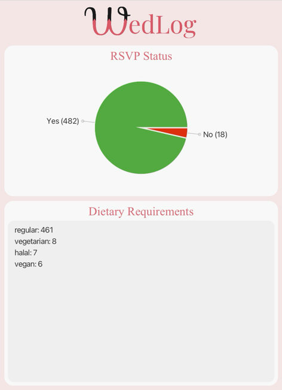
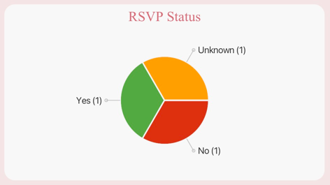
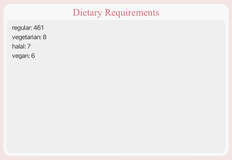

# User Guide

<!-- * Table of Contents -->
<page-nav-print />

## Welcome to WedLog

_**Wedding planning made simple**_

WedLog is a lightweight and powerful wedding planning application designed to help brides and grooms manage important details about their wedding. By simplifying the complexities of wedding planning, WedLog offers an intuitive and stress-free experience guaranteed to streamline the planning process. Tailored for keyboard-based interaction, WedLog ensures optimized usability through efficient input typing.

Here's a quick summary of what WedLog can do for you:
* View, categorise and update information about guests and vendors
* Filter guests by table number, tags and more
* Track key statistics (eg. number of guests RSVP-ed)

--------------------------------------------------------------------------------------------------------------------

1. [Quick Start](#1-quick-start)
2. [Features](#2-features) 
    2.1. [Add Command](#2-1-add-command) 
    &emsp; 2.1.1. [Adding a guest: `guest add`](#2-1-1-adding-a-guest-guest-add) 
    &emsp; 2.1.2. [Adding a vendor: `vendor add`](#2-1-2-adding-a-vendor-vendor-add) 
    2.2. [Delete Command](#2-2-delete-command) 
    &emsp; 2.2.1. [Deleting a guest: `guest delete`](#2-2-1-deleting-a-guest-guest-delete) 
    &emsp; 2.2.2. [Deleting a vendor: `vendor delete`](#2-2-2-deleting-a-vendor-vendor-delete) 
    2.3. [Edit Command](#2-3-edit-command) 
    &emsp; 2.3.1. [Editing a guest: `guest edit`](#2-3-1-editing-a-guest-guest-edit) 
    &emsp; 2.3.2. [Editing a vendor: `vendor edit`](#2-3-2-editing-a-vendor-vendor-edit) 
    2.4. [List Command](#2-4-list-command) 
    &emsp; 2.4.1. [Viewing all guests: `guest list`](#2-4-1-viewing-all-guests-guest-list) 
    &emsp; 2.4.2. [Viewing all vendors: `vendor list`](#2-4-2-viewing-all-vendors-vendor-list) 
    2.5. [Filter Command](#2-5-filter-command) 
    &emsp; 2.5.1. [Filtering guests: `guest filter`](#2-5-1-filtering-guests-guest-filter) 
    &emsp; 2.5.2. [Filtering vendor: `vendor filter`](#2-5-2-filtering-vendors-vendor-filter) 
    2.6. [General Commands](#2-6-general-commands) 
    &emsp; 2.6.1 [Viewing help: `help`](#2-6-1-viewing-help-help) 
    &emsp; 2.6.2 [Undoing last action: `undo`](#2-6-2-undoing-last-action-undo) 
    &emsp; 2.6.3 [Redoing last action: `redo`](#2-6-3-redoing-last-action-redo) 
    &emsp; 2.6.4 [Clearing guest and vendor lists: `clear`](#2-6-4-clearing-guest-and-vendor-lists-clear) 
    &emsp; 2.6.5 [Exiting the program: `exit`](#2-6-5-exiting-the-program-exit) 
    2.7 [Quick View Panel](#2-7-quick-view-panel) 
    &emsp; 2.7.1 [RSVP Status panel](#2-7-1-rsvp-status-panel) 
    &emsp; 2.7.2 [Dietary Requirements panel](#2-7-2-dietary-requirements-panel) 
3. [FAQ](#3-faq)
4. [Known Issues](#4-known-issues)
5. [Future implementations](#5-future-implementations)
6. [Command Summary](#6-command-summary) 
7. [Appendices](#7-appendices) 
   7.1. [Appendix A: Acceptable values for parameters](#7-1-appendix-a-acceptable-values-for-parameters) 
   7.2. [Appendix B: Miscellaneous error messages](#7-2-appendix-b-miscellaneous-error-messages)

--------------------------------------------------------------------------------------------------------------------

## 1. How to use this guide

### 1.1 Notations used in this guide

Coloured boxes are used throughout this guide to provide additional information for your reference.

These are alerts which you should take note of before using the command.

These are useful tips that you should take note of before using the command.

These are information about the parameters that are included for your convenience.

### 1.2 New users

If you are new here, welcome to WedLog!

To get started on your wedding planning journey, check out our [quick start guide](#1-quick-start) for a step-by-step guide to download WedLog.

Once you have set up WedLog on your computer, head over to our [getting started](#getting-started) section to take your first steps to plan your wedding.

### 1.3 Experienced users

If you have some experience with WedLog, welcome back! 

For a quick overview of WedLog's commands, jump straight to our [command summary](#6-command-summary).

If you would like a detailed look into each of the features WedLog has to offer, visit the [features](#2-features) section of this guide.

--------------------------------------------------------------------------------------------------------------------

## 1. Quick start

1. Ensure you have Java `11` or above installed in your Computer.

2. Download the latest `wedlog.jar` from [here](https://github.com/AY2324S1-CS2103T-F11-2/tp/releases).

3. Copy the file to the folder you want to use as the _home folder_ for your WedLog.

4. Open a command terminal, `cd` into the folder you put the jar file in, and use the `java -jar wedlog.jar` command to run the application. 
   
5. A GUI similar to the one below should appear in a few seconds. Note how the app contains some sample data. 
   

6. Type the command in the command box and press Enter to execute it. e.g. typing **`help`** and pressing Enter will open the help window.
   Refer to the [Features](#2-features) below for details of each command.

--------------------------------------------------------------------------------------------------------------------

## 2. Features

**Notes about the command format:**  

* Words are defined to be any letters, numbers or special characters of length 1 or more (non-blank).

* Each parameter takes the form `x/ABC`, where the small letters and backslash (e.g. `x/`) represents the label, 
and the words in upper case (e.g. `ABC`) represents the values.

* Labels should be used in the exact format described in this guide. However, values can be replaced with 
your own information.  
  e.g. in `guest add n/NAME`, `NAME` is a value which can be replaced, as in `guest add n/Gina Gan`.

* Parameters in square brackets are optional. 
  e.g. `n/NAME [t/TAG]` can be used as `n/Gina Gan t/friend` or as `n/Gina Gan`.

* Parameters with `…` after them can be used multiple times including zero times.
  e.g. `[t/TAG]…` can be used as ` ` (i.e. 0 times), `t/friend`, `t/friend t/family` etc.

* Parameters can be in any order. 
  e.g. if the command specifies `n/NAME p/PHONE`, `p/PHONE n/NAME` is also acceptable.

* Extra input for commands that do not take in parameters (such as `help`, `guest list`, `undo` and `exit`) will be ignored. 
  e.g. if you input `help 123`, it will be interpreted as `help`.

 

If you are using a PDF version of this document, be careful when copying and pasting commands that span multiple lines 
as space characters surrounding line-breaks may be omitted when copied over to the application.

 

> [Back to top](#wedlog-user-guide)

--------------------------------------------------------------------------------------------------------------------

### 2.1 Add Command

#### 2.1.1. Adding a guest: `guest add`

Allows you to add a guest to WedLog, keeping track of important details such as their RSVP status, dietary requirements, and more.

Format: `guest add n/NAME [p/PHONE] [e/EMAIL] [a/ADDRESS] [r/RSVP_STATUS] [tn/TABLE_NUMBER] [d/DIETARY_REQUIREMENT]… [t/TAG]…`

**Parameter information:**

* Parameters in square brackets are optional.
* A guest can have any number of dietary requirements and tags (including 0). 

Refer to [Appendix A](#7-1-appendix-a-acceptable-values-for-parameters) for more details on the acceptable values for the parameters.

**Note:**

* A person can be recorded as both a guest and vendor. (e.g. Even if there is a vendor named `Gia`, you are also able to add a guest named `Gia`)

Examples:
- `guest add n/Gina p/91234567 a/Blk 123 r/no`: Adds a guest named `Gina` with phone number `91234567`, address `Blk 123`, 
and RSVP status of `No`.
- `guest add n/Gerald d/ r/`: Adds a guest named `Gerald` with no dietary requirements and unknown RSVP status.
- `guest add n/Georgiana Tan t/family t/bridesmaid`: Adds a guest named `Georgiana` with two tags, `family` and `bridesmaid`.

Expected behaviour upon success:
- Adds the guest.
- Displays a message showing the added guest.

Expected behaviour upon failure:
- As `NAME` is a compulsory parameter for vendors, not providing this parameter would result
  in the error message “Invalid command format!” followed by instruction on guest add usage.
- Providing invalid values for parameters with input restrictions will also trigger error messages. Refer to [Appendix A](#7-1-appendix-a-acceptable-values-for-parameters) 
for details on acceptable values for each parameter, as well as the error message for invalid values.

--------------------------------------------------------------------------------------------------------------------

#### 2.1.2. Adding a vendor: `vendor add`

Allows you to add a vendor to WedLog, so that you can streamline coordination with the people involved in making your dream wedding a reality.

Format: `vendor add n/NAME [p/PHONE] [e/EMAIL] [a/ADDRESS] [t/TAG]…`

**Parameter information:**

* Parameters in square brackets are optional.
* A vendor can have any number of tags (including 0).

Refer to [Appendix A](#7-1-appendix-a-acceptable-values-for-parameters) for more details on the acceptable values for the parameters.

**Note:**

* A person can be recorded as both a guest and vendor. (e.g. Even if there is a guest named `Gia`, you are also able to add a vendor named `Gia`)

Examples:
- `vendor add n/Valerie Tan p/91234567 a/12 Buona Vista St`: Adds a vendor named `Valerie Tan` with phone number `91234567`
and address `12 Buona Vista St`.
- `vendor add n/Victor Wong e/victorwflowers@email.com t/florist t/photographer`: Adds a vendor named "Victor Wong" with
the email `victorwflowers@email.com` and the tags `florist` and `photographer`. 

Expected behaviour upon success:
- Adds a vendor to the vendor list.
- Displays the vendor that has been added.

Expected behaviour upon failure:
- As `NAME` is a compulsory parameter for vendors, not providing this parameter would result
  in the error message “Invalid command format!” followed by instruction on vendor add usage.
- Providing invalid values for parameters with input restrictions will also trigger error messages. Refer to [Appendix A](#7-1-appendix-a-acceptable-values-for-parameters)
  for details on acceptable values for each parameter, as well as the error message for invalid values.

 

> [Back to top](#wedlog-user-guide)

--------------------------------------------------------------------------------------------------------------------

### 2.2. Delete Command

#### 2.2.1. Deleting a guest: `guest delete`

Allows you to delete a guest from WedLog, so that you can tackle last-minute changes and refine your guest list with ease.

Format: `guest delete INDEX`

**Parameter information:**

* `INDEX` must be a positive integer. (e.g. 1, 2, 3…)

Examples:
- `guest delete 2` deletes the 2nd guest on the guest list.
- `guest filter n/Gina` followed by `guest delete 1` deletes the 1st guest in the results of the `filter` command.

Expected behaviour upon success:
- Deletes the guest at the specified `INDEX`.
- Displays a message telling user which guest has been deleted.

**Warning:**

* If the previous command was `guest filter KEY_WORDS`, the `INDEX` refers to the index number shown in the filtered guest list.
* Otherwise, the `INDEX` refers to the index number on the unfiltered guest list.

Expected behaviour upon failure:
- Number out of index range: Displays error message "The guest index provided is invalid.".
- Input for index not a number, or no number: Displays error message "Invalid command format!" followed by instruction on guest delete usage.

--------------------------------------------------------------------------------------------------------------------

#### 2.2.2. Deleting a vendor: `vendor delete`

Allows you to delete a vendor from WedLog, so that you can tailor your dream team to match your evolving wedding vision.

Format: `vendor delete INDEX`

**Parameter information:**

* `INDEX` must be a positive integer. (e.g. 1, 2, 3…)

Examples:
- `vendor list` followed by `vendor delete 2` deletes the 2nd vendor on the vendor list.
- `vendor filter n/Valencia` followed by `vendor delete 1` deletes the 1st vendor in the results of the `filter` command.

Expected behaviour upon success:
- Deletes the vendor at the specified `INDEX`.
- Displays a message telling user which vendor has been deleted.

**Warning:**

* If the previous command was `vendor filter KEY_WORDS`, the `INDEX` refers to the index number shown in the filtered vendor list.
* Otherwise, the `INDEX` refers to the index number on the unfiltered vendor list.

Expected behaviour upon failure:
- Number out of index range: Displays error message "The vendor index provided is invalid.".
- Input for index not a number, or no number: Displays error message "Invalid command format!" followed by instruction on vendor delete usage.

 

> [Back to top](#wedlog-user-guide)

--------------------------------------------------------------------------------------------------------------------

### 2.3. Edit Command

#### 2.3.1. Editing a guest : `guest edit`

Allows you to edit a guest's details, so that you can keep track of the latest information about your guests.

Format: `guest edit INDEX [n/NAME] [p/PHONE] [e/EMAIL] [a/ADDRESS] [r/RSVP_STATUS] [tn/TABLE_NUMBER] [d/DIETARY_REQUIREMENT]… [t/TAG]…`

**Parameter information:**

* `INDEX` must be a positive integer. (e.g. 1, 2, 3…)
* Parameters in square brackets are optional. However, you must include at least one parameter to edit.
* An edit command can have any number of dietary requirements and tags (including 0).
* Specifying an empty parameter (e.g. `p/`) will delete the parameter's value from the guest.
* An edit command requires at least 1 parameter.

Refer to [Appendix A](#7-1-appendix-a-acceptable-values-for-parameters) for more details on the acceptable values for the parameters.

**Note:**

* If the edited name specified in n/NAME corresponds to the name of an existing guest in WedLog, an error message will be displayed.

Examples:
- `guest list` followed by `guest edit 2 p/914624435` edits the phone number of the 2nd guest to be `91462435`.
- `guest filter n/Gina` followed by `guest edit 1 n/Ginette` edits the name of the 1st guest in the results of the `filter` command to be `Ginette`.

Expected behaviour upon success:
- Edits the guest at the specified `INDEX`.
- Displays the guest that has been edited.

**Warning:**

* If the previous command was `guest filter KEY_WORDS`, the `INDEX` refers to the index number shown in the filtered guest list.
* Otherwise, the `INDEX` refers to the index number on the unfiltered guest list.

Expected behaviour upon failure:
(in order of priority)
- Index is not a number, or no index provided: Displays error message "Invalid command format!" followed by instruction on guest edit usage.
- No parameters provided: Displays error message "At least one field to edit must be provided.".
- Index does not correspond to any guest: Displays error message "The guest index provided is invalid.".

--------------------------------------------------------------------------------------------------------------------

#### 2.3.2. Editing a vendor : `vendor edit`

Allows you to edit a vendor's details, so that you can keep track of the latest information about your vendors.

Format: `vendor edit INDEX [n/NAME] [p/PHONE] [e/EMAIL] [a/ADDRESS] [t/TAG]…`

Acceptable values for INDEX
- A positive integer.

**Parameter information:**

* `INDEX` must be a positive integer. (e.g. 1, 2, 3…)
* Parameters in square brackets are optional. However, you must include at least one parameter to edit.
* An edit command can have any number of tags (including 0).
* Specifying an empty parameter (e.g. `p/`) will delete the parameter's value from the vendor.
* An edit command requires at least 1 parameter.

Refer to [Appendix A](#7-1-appendix-a-acceptable-values-for-parameters) for more details on the acceptable values for the parameters.

**Note:**

* If the edited name specified in n/NAME corresponds to the name of an existing guest in WedLog, an error message will be displayed.

Examples:
- `vendor list` followed by `vendor edit 2 p/914624435` edits the phone number of the 2nd vendor to be `91462435`.
- `vendor filter n/Valerie` followed by `vendor edit 1 n/Val` edits the name of the 1st vendor in the results of the `filter` command to be `Val`.

Expected behaviour upon success:
- Edits the vendor at the specified `INDEX`.
- Displays the vendor that has been edited.

**Warning:**

* If the previous command was `vendor filter KEY_WORDS`, the `INDEX` refers to the index number shown in the filtered vendor list.
* Otherwise, the `INDEX` refers to the index number on the unfiltered vendor list.

Expected behaviour upon failure:
(in order of priority)
- Index is not a number, or no index provided: Displays error message "Invalid command format!" followed by instruction on vendor edit usage.
- No parameters provided: Displays error message "At least one field to edit must be provided.".
- Index does not correspond to any guest: Displays error message "The vendor index provided is invalid.".

 

> [Back to top](#wedlog-user-guide)

--------------------------------------------------------------------------------------------------------------------

### 2.4. List Command

#### 2.4.1. Viewing all guests: `guest list`

Allows you to view all guests in WedLog, so that you can see the big picture that is your entire guest list.

Format: `guest list`

Expected behaviour upon success:
- Displays a list of all guest names and their respective indexes. 
    - Example: 1. Gina Tan, 2. Gabriel Lim
- If there is one or more guests, displays the message "Listed all guests". Else, displays the message "No guests recorded".

Expected behaviour upon failure:
- Refer to [Appendix B](#7-2-appendix-b-miscellaneous-error-messages): Expected behaviour upon general failure.

--------------------------------------------------------------------------------------------------------------------

#### 2.4.2. Viewing all vendors: `vendor list`

Allows you to view all vendors in WedLog, so that you can see all the people involved in making your dream wedding a reality.

Format: `vendor list`

Expected behaviour upon success:
- Displays a list of all vendor names and their respective indexes.
    - Example: 1. Valerie Tan, 2. Victor Lim
- If there is one or more vendors, displays the message "Listed all vendors". Else, displays the message "No vendors recorded".

Expected behaviour upon failure:
- Refer to [Appendix B](#7-2-appendix-b-miscellaneous-error-messages): Expected behaviour upon general failure.

 

> [Back to top](#wedlog-user-guide)

--------------------------------------------------------------------------------------------------------------------

### 2.5. Filter Command

#### 2.5.1. Filtering guests: `guest filter`

Allows you to filter guests by their details and more, so that you can pick out details that matter to you and your guests
and zoom in to your guest list accordingly.

Format: `guest filter [n/NAME] [p/PHONE] [e/EMAIL] [a/ADDRESS] [r/RSVP_STATUS] [tn/TABLE_NUMBER] [d/DIETARY_REQUIREMENT]… [t/TAG]…`

**Parameter information:**

* You can use any combination of letters, numbers and special characters as inputs for all parameters. 
* Parameters in square brackets are optional. However, you must include at least one parameter to filter by.
* For all parameters aside from `NAME` and `RSVP_STATUS`, providing an empty value (e.g. `p/`) will filter for guests with unfilled values for that parameter. 
* Providing an empty `r/` value would filter for guests with RSVP status `Unknown`. 
* Providing an empty `n/` value would filter for guests without a name thus returning an empty guest list. (All guests need a name)
* `DIETARY_REQUIREMENT` and `TAG` parameters can be inputted multiple times (e.g. `guest filter d/no beef d/no pork`).

**Note:**

* The filter command will only return guests that match all the input values across different parameters.
* The following parameters are filtered via a case-insensitive partial match (i.e. `guest filter n/john` returns `john` and `johnathan`).
  * `NAME`
  * `PHONE`
  * `EMAIL`
  * `ADDRESS`
* The following parameters are filtered via a case-insensitive exact match (i.e. a guest with the tag `friends` would not be a valid result for the input `t/friend`).
  * `RSVP_STATUS`
  * `TABLE_NUMBER`
  * `DIETARY_REQUIREMENT`
  * `TAG`

Examples:
- `guest filter n/Gia r/no`: filters for guests with `Gia` in their names who have RSVP status of `no`. Results might include `Gia Lee, RSVP: no` and `Gianna Tan, RSVP: no`.
- `guest filter d/`: filters for guests with no dietary requirements.
- `guest filter t/`: filters for guests with no tags.
- `guest filter d/no beef d/no pork`: filters for all guests who are tagged with both `no beef` and `no pork` in their dietary requirements field.

Expected behaviour upon success:
- Displays a list of guests that match all the inputted values.
- Displays a message showing the total number of results found.

Expected behaviour upon failure:
- No parameter (e.g. `guest filter`): Displays error message "No prefix was found in the command!" followed by instruction on guest filter usage.

--------------------------------------------------------------------------------------------------------------------

#### 2.5.2. Filtering vendors: `vendor filter`

Elevate your wedding curation with precision. Filter vendors by their details and more, allowing you to manage crucial 
arrangements and allocation with ease.

Allows you to filter vendors by their details and more, so that you can manage arrangements and allocations and 
zoom in to your vendor list accordingly.

Format: `vendor filter [n/NAME] [p/PHONE] [e/EMAIL] [a/ADDRESS] [t/TAG]…`

**Parameter information:**

* You can use any combination of letters, numbers and special characters as inputs for all parameters.
* Parameters in square brackets are optional. However, you must include at least one parameter to filter by.
* For all parameters aside from `NAME`, providing an empty value (e.g. `p/`) will filter for vendors with unfilled values for that parameter.
* Providing an empty `n/` value would filter for vendors without a name thus returning an empty vendors list. (All vendors need a name)
* `TAG` parameter can be inputted multiple times (e.g. `vendor filter t/photographer t/dj`).

**Note:**

* The filter command will only return vendors that match all the input values across different parameters.
* The following parameters are filtered via a case-insensitive partial match (i.e. `vendor filter n/john` returns `john` and `johnathan`).
    * `NAME`
    * `PHONE`
    * `EMAIL`
    * `ADDRESS`
* The following parameters are filtered via a case-insensitive exact match (i.e. a vendor with the tag `djay` would not be a valid result for the input `t/dj`).
    * `TAG`

Examples:
- `vendor filter n/Val`: Filter for all vendors with "Val" in their names. Results may include `Val Tan, tag: Photographer`
and `Valerie Lee, tag: Florist`.
- `vendor filter t/photographer t/dj`: Filter for all vendors tagged as both `photographer` and `dj`. Results may include 
`Veronica, tags: photographer, dj`, but not `Victor, tags: photographer` and `Valen, tags: photographer, djay`.
- `vendor filter p/`: filter for all vendors with empty phone numbers.

Expected behaviour upon success:
- Displays a list of vendors that match all the inputted values.
- Displays a message showing the total number of results found.

Expected behaviour upon failure:
- No parameter (e.g. `vendor filter`): Displays error message "No prefix was found in the command!" followed by instruction on vendor filter usage.

 

> [Back to top](#wedlog-user-guide)

--------------------------------------------------------------------------------------------------------------------

### 2.6. General Commands

#### 2.6.1. Viewing help: `help`

Allows you to access the URL to our user guide at any time, in case you need to refer to it.

Format: `help`

--------------------------------------------------------------------------------------------------------------------

#### 2.6.2. Undoing last action: `undo`

Allows you to undo the last action, so that you can correct mistakes and keep your wedding planning on track.

Format: `undo`

**Note:**

* The undo command can also be triggered by pressing Control + Z (Windows) or Command + Z (Mac) on the keyboard.

Examples:
- `vendor delete 2` followed by `undo` deletes, then restores the 2nd vendor in WedLog.

Expected behaviour upon success:
- Restores WedLog to its previous state.

Expected behaviour upon failure:
- No states to undo: Displays error message “There is no change to undo!”

--------------------------------------------------------------------------------------------------------------------

#### 2.6.3. Redoing last action: `redo`

Allows you to redo the last action, so that you can correct mistakes and keep your wedding planning on track.

Format: `redo`

* The redo command can be triggered by pressing Control + Y (Windows) or Command + Y (Mac) on the keyboard.

Examples:
- `vendor delete 2`, followed by `undo`, followed by `redo` deletes, then restores, then re-deletes the 2nd vendor in WedLog.

Expected behaviour upon success:
- Restores WedLog to its previous state before the last undo.

Expected behaviour upon failure:
- No states to redo: Displays error message “There is no change to redo!”

--------------------------------------------------------------------------------------------------------------------

### 2.6.4. Clearing guest and vendor lists: `clear`

Allows you to clear the guest and vendor lists, so that you can start planning your wedding from a clean slate.

format: `clear`

Expected behaviour upon success:
- Removes all guest and vendors in the guest and vendor lists respectively.

* If you have mistakenly cleared the lists, use the [undo command](#262-undoing-last-action-undo) to restore your data.

--------------------------------------------------------------------------------------------------------------------

### 2.6.5. Exiting the program: `exit`

Allows you to exit the program, so that you can wrap up your planning session seamlessly and pick up where you left off next time.

Format: `exit`

>Tips:
> 
>- Upon exit, the latest data is saved to your machine at `data/addressbook.json`.

 

> [Back to top](#wedlog-user-guide)

--------------------------------------------------------------------------------------------------------------------

### 2.7. Quick View Panel

The Quick View panel allows you to see general details of your guests at a glance. It is located on the left side of the window.

  

The Quick View panel consists of 2 sections: the RSVP Status panel and the Dietary Requirements panel.

--------------------------------------------------------------------------------------------------------------------

#### 2.7.1. RSVP Status panel

The RSVP Status panel is designed to help you keep track of the proportion of RSVP statuses of your guests. The data is 
represented using a pie chart, with labels indicating the number of guests with each RSVP status. The pie chart is updated automatically
whenever you add, delete or edit a guest.

  

The pie chart slices are colour-coded as follows:
- `Yes`: Green
- `No`: Red
- `Unknown`: Orange

--------------------------------------------------------------------------------------------------------------------

#### 2.7.2. Dietary Requirements panel

The Dietary Requirements panel is designed to help you keep track of your guests' dietary requirements. Whenever you specify
a guest to have certain dietary requirements, the requirements will be added to the panel alongside the total number
of guests with the same requirements. 

This panel consolidates your guests' dietary requirements to be displayed together, 
for you to consider when planning the menu for your wedding. The panel is also updated automatically whenever you add, delete or edit a guest.

  

Things to note:
- **The panel only displays dietary requirements for guests with RSVP status "Yes".** This is because guests with RSVP status "No" or "Unknown" 
are not expected to attend the wedding, and hence do not need to have their dietary requirements taken into account.
- If a guest has no specified dietary requirements, we will consider the guest to have "regular" dietary requirements.
- Dietary requirements are displayed in descending order of the number of guests with the same requirements. 

 

> [Back to top](#wedlog-user-guide)

--------------------------------------------------------------------------------------------------------------------

## 3. FAQ

**Q**: How do I transfer my data to another Computer? 
**A**: Install the app in the other computer and overwrite the empty data file it creates with the file that contains the data of your previous AddressBook home folder.

--------------------------------------------------------------------------------------------------------------------

## 4. Known issues

1. **When using multiple screens**, if you move the application to a secondary screen, and later switch to using only the primary screen, the GUI will open off-screen. The remedy is to delete the `preferences.json` file created by the application before running the application again.

## 5. Future implementations

1. `guest clear` and `vendor clear` features will be implemented in the future. This feature will allow users to clear the guest list or vendor list quickly.

--------------------------------------------------------------------------------------------------------------------

## 6. Command summary

| Action             | Format                                                                                                                           | Example                                                                                       |
|--------------------|:---------------------------------------------------------------------------------------------------------------------------------|-----------------------------------------------------------------------------------------------|
| Add a guest        | `guest add n/NAME [p/PHONE] [e/EMAIL] [a/ADDRESS] [r/RSVP_STATUS] [tn/TABLE_NUMBER] [d/DIETARY_REQUIREMENT]… [t/TAG]…`           | `guest add n/John Doe p/98765432 e/john@doe.com a/Street 456 r/unknown d/vegetarian t/friend` |
| Add a vendor       | `vendor add n/NAME [p/PHONE] [e/EMAIL] [a/ADDRESS] [t/TAG]…`                                                                     | `vendor add n/Betsy p/91234567`                                                               |
| Delete a guest     | `guest delete INDEX`                                                                                                             | `guest delete 1`                                                                              |
| Delete a vendor    | `vendor delete INDEX`                                                                                                            | `vendor delete 2`                                                                             |
| Edit a guest       | `guest edit INDEX [n/NAME] [p/PHONE]  [e/EMAIL] [a/ADDRESS] [r/RSVP_STATUS] [tn/TABLE_NUMBER] [d/DIETARY_REQUIREMENT]… [t/TAG]…` | `guest edit 1 p/98765432 r/unknown`                                                           |
| Edit a vendor      | `vendor edit INDEX [n/NAME] [p/PHONE] [e/EMAIL] [a/ADDRESS] [t/TAG]…`                                                            | `vendor edit 2 p/914624435`                                                                   |
| View all guests    | `guest list`                                                                                                                     |                                                                                               |
| View all vendors   | `vendor list`                                                                                                                    |                                                                                               |
| Filter guest list  | `guest filter [n/NAME] [p/PHONE] [e/EMAIL] [a/ADDRESS] [r/RSVP_STATUS] [d/DIETARY_REQUIREMENTS] [tn/TABLE_NUMBER] [t/TAG]…`      | `guest filter n/Keith p/92354567 r/yes`                                                       |
| Filter vendor list | `vendor filter [n/NAME] [p/PHONE] [e/EMAIL] [a/ADDRESS] [t/TAG]…`                                                                | `vendor filter n/John Doe p/91234567 e/johndflowers@email.com a/123 Flower Lane`              |
| View help          | `help`                                                                                                                           |                                                                                               |
| Undo last action   | `undo`                                                                                                                           |                                                                                               |
| Redo last action   | `redo`                                                                                                                           |                                                                                               |
| Clear both lists   | `clear`                                                                                                                          |                                                                                               |
| Exit program       | `exit`                                                                                                                           |                                                                                               |

--------------------------------------------------------------------------------------------------------------------

## 7. Appendices

### 7.1. Appendix A: Acceptable values for parameters

Acceptable values for `n/NAME`:
- Alphanumeric word with or without spaces and should not be blank.
- Error message for invalid name: “Names should only contain alphanumeric characters and spaces, and it should not be blank”.

Acceptable values for `p/PHONE`:
- Numbers with no spaces or special characters.
- At least 3 numbers.
- Error message for invalid phone number: "Phone numbers should only contain numbers, and it should be at least 3 digits long".

Acceptable values for `e/EMAIL`:
- `local-part@domain`
    - the `local-part` must:
        - contain alphanumeric characters and these special characters, excluding the parentheses (+_.-)
        - not start or end with any special characters.
    - the `domain` must:
        - consist of domain labels separated by periods.
        - end with a domain label at least 2 characters long.
        - have each domain label start and end with alphanumeric characters.
        - have each domain label consist of alphanumeric characters, separated only by hyphens, if any.
- Error message for invalid email:
 
"Emails should be of the format local-part@domain and adhere to the following constraints:
1. The local-part should only contain alphanumeric characters and these special characters, excluding the parentheses, (+_.-). The local-part may not start or end with any special characters.
2. This is followed by a '@' and then a domain name. The domain name is made up of domain labels separated by periods.
   The domain name must:
    - end with a domain label at least 2 characters long
    - have each domain label start and end with alphanumeric characters
    - have each domain label consist of alphanumeric characters, separated only by hyphens, if any.".

Acceptable values for `a/ADDRESS`:
- Word with or without spaces.
- Error message for invalid address: "Addresses can take any values, and it should not be blank".

Acceptable values for `r/RSVP_STATUS`:
- `yes`
- `no`
- `unknown`
- Inputs with no values when adding a guest (e.g. `r/`) signify that RSVP status should be stored as `unknown`.
- Inputs with no values when filtering guests (e.g. `r/`) signify that you wish to filter for guests with `unknown` RSVP status.
- Error message for invalid RSVP status: “RsvpStatus Status should only have one of three values. yes, no, or unknown.”.

Acceptable values for `d/DIETARY_REQUIREMENT`:
- Alphanumeric word with or without spaces and should not be blank.
- Error message for invalid table numbers: "Dietary requirements should only contain alphanumeric characters and spaces, and it should not be blank"

Acceptable values for `tn/TABLE_NUMBER`:
- Numbers between 1 and 2147483647 inclusive with no spaces or special characters
- Preceding zeros will be trimmed.
- Error message for invalid table numbers: "Table numbers should only contain numbers"

Acceptable values for `t/TAG`:
- Alphanumeric word without spaces.
- Error message for invalid tags: "Tags names should be alphanumeric"

--------------------------------------------------------------------------------------------------------------------

### 7.2. Appendix B: Miscellaneous error messages

User input is completely invalid (e.g. `abc` or `vsdf`):
- Display error message "Unknown command.".
   
User input begins with `vendor` or `guest`, but does not include a valid command word (e.g. `vendor abc` or `guest adddd`):
- Display error message:
   
"Invalid command format!
 
help: Shows program usage instructions.
 
Example: help".

 

> [Back to top](#wedlog-user-guide)
